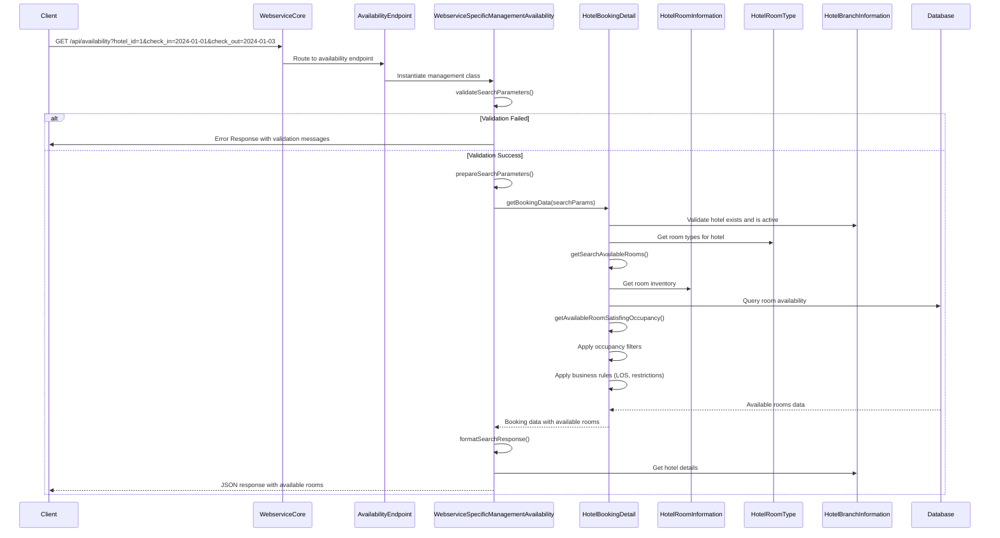

# Hotel Availability Search Flow

## Overview

The availability search flow is the core process for finding available rooms based on check-in/check-out dates, occupancy requirements, and hotel preferences. This document outlines the complete flow from API request to response.

## Flow Diagram



## Process Steps

### 1. Request Validation
**File:** `/modules/hotelreservationsystem/classes/WebserviceSpecificManagementAvailability.php:74-127`

**Required Parameters:**
- `hotel_id` or `id_hotel` - Hotel identifier
- `check_in` or `date_from` - Check-in date (Y-m-d format)
- `check_out` or `date_to` - Check-out date (Y-m-d format)

**Optional Parameters:**
- `adults` - Number of adults (default: 2)
- `children` - Number of children (default: 0)
- `room_type` - Specific room type filter

**Validation Rules:**
- Hotel ID must be a valid positive integer
- Dates must be in Y-m-d format
- Check-in date cannot be in the past
- Check-out date must be after check-in date
- Occupancy values must be positive integers

### 2. Parameter Preparation
**File:** `/modules/hotelreservationsystem/classes/WebserviceSpecificManagementAvailability.php:129-170`

The system normalizes input parameters and prepares search criteria:

```php
$searchParams = array(
    'hotel_id' => $hotelId,
    'date_from' => $dateFrom,
    'date_to' => $dateTo,
    'id_room_type' => $roomType,
    'occupancy' => $occupancy,
    'search_available' => 1,
    'search_partial' => 0,
    'search_booked' => 0,
    'search_unavai' => 0,
    'search_cart_rms' => 0,
    'only_search_data' => 0,
    'only_active_roomtype' => 1,
    'only_active_hotel' => 1
);
```

### 3. Availability Search Algorithm
**File:** `/modules/hotelreservationsystem/classes/HotelBookingDetail.php:273-503`

The `getBookingData()` method orchestrates the complete availability search:

#### 3.1 Hotel Validation
- Verify hotel exists and is active
- Check user access permissions for hotel

#### 3.2 Room Type Filtering
- Get all room types for the hotel
- Filter by specific room type if requested
- Exclude inactive room types

#### 3.3 Room Status Filtering
**File:** `/modules/hotelreservationsystem/classes/HotelBookingDetail.php:504-596`

The system identifies unavailable rooms:
- **Inactive Rooms:** `STATUS_INACTIVE = 2`
- **Temporarily Disabled:** `STATUS_TEMPORARY_INACTIVE = 3`
- **LOS Restrictions:** Rooms not meeting length-of-stay requirements
- **Maintenance Periods:** Rooms with disable date ranges

#### 3.4 Occupancy Validation
**File:** `/modules/hotelreservationsystem/classes/HotelBookingDetail.php:839-935`

Advanced occupancy matching algorithm:
- Match adult and children capacity requirements
- Consider maximum occupancy limits
- Apply flexible matching based on search algorithm type

#### 3.5 Booking Conflict Check
- Check existing bookings for date range
- Exclude rooms already booked
- Verify cart bookings don't conflict

### 4. Response Formatting
**File:** `/modules/hotelreservationsystem/classes/WebserviceSpecificManagementAvailability.php:172-236`

The system formats available rooms into a structured response:

```json
{
    "success": true,
    "timestamp": "2024-01-01 12:00:00",
    "search_criteria": {
        "hotel_id": 1,
        "check_in": "2024-01-01",
        "check_out": "2024-01-03",
        "occupancy": [{"adults": 2, "children": 0}],
        "room_type": 0
    },
    "hotels": [{
        "id_hotel": 1,
        "hotel_name": "Sample Hotel",
        "email": "hotel@example.com",
        "check_in": "14:00",
        "check_out": "12:00",
        "rating": 4,
        "available_rooms": [{
            "id_room": 101,
            "id_product": 1,
            "id_room_type": 1,
            "room_type_name": "Standard Room",
            "room_num": "101",
            "room_comment": "",
            "adults": 2,
            "children": 0,
            "max_adults": 2,
            "max_children": 1,
            "max_guests": 3,
            "max_occupancy": 3
        }]
    }],
    "total_available_rooms": 1
}
```

## Key Database Tables

### Primary Tables
- **`htl_booking_detail`** - Active bookings and reservations
- **`htl_room_information`** - Individual room inventory
- **`htl_room_type`** - Room type definitions and capacity
- **`htl_branch_info`** - Hotel property information

### Supporting Tables
- **`htl_cart_booking_data`** - Rooms in customer carts
- **`htl_room_disable_dates`** - Temporary room unavailability
- **`htl_room_type_restriction_date_range`** - Booking restrictions

## Business Rules Applied

### 1. Length of Stay (LOS) Restrictions
- Minimum stay requirements per room type
- Maximum stay limitations
- Date-specific LOS rules

### 2. Occupancy Rules
- Adult capacity limits per room
- Children capacity with age considerations
- Maximum total occupancy enforcement

### 3. Booking Restrictions
- Advance booking requirements
- Restriction date ranges
- Seasonal availability rules

### 4. Room Status Rules
- Active room requirement
- Maintenance schedule exclusions
- Temporary disable date ranges

## Error Handling

### Validation Errors
- Missing required parameters
- Invalid date formats
- Past date check-in attempts
- Invalid occupancy values

### Business Logic Errors
- Hotel not found or inactive
- No rooms available for criteria
- Access permission violations
- System configuration errors

## Performance Considerations

### Query Optimization
- Indexed searches on booking dates
- Hotel-specific room filtering
- Cached hotel information lookup

### Response Caching
- Hotel details caching
- Room type information caching
- Availability result optimization

## Integration Points

### PrestaShop Integration
- Room types linked to products
- Cart integration for pricing
- Customer session management

### External APIs
- Channel manager integration ready
- Rate and inventory updates
- Booking synchronization support

## Configuration Options

### Search Algorithm Types
- **`SEARCH_EXACT_ROOM_TYPE_ALGO = 1`** - Exact occupancy matching
- **`SEARCH_ALL_ROOM_TYPE_ALGO = 2`** - Flexible room type matching

### Room Selection Types  
- **`PS_ROOM_UNIT_SELECTION_TYPE_OCCUPANCY = 1`** - Occupancy-based booking
- **`PS_ROOM_UNIT_SELECTION_TYPE_QUANTITY = 2`** - Quantity-based booking

This availability flow ensures accurate, real-time room availability while maintaining high performance and business rule compliance.