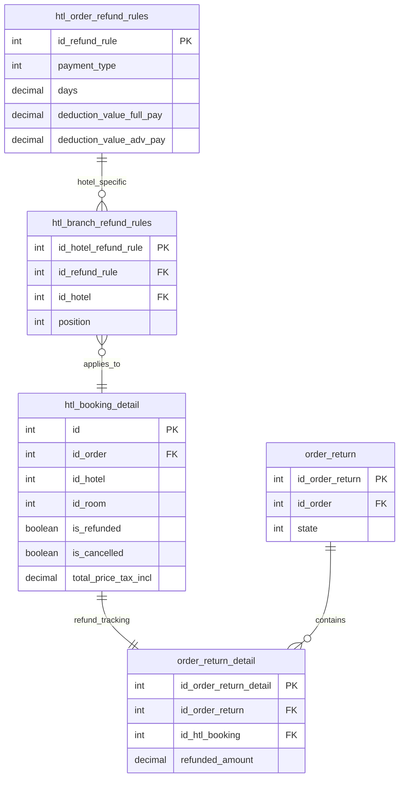
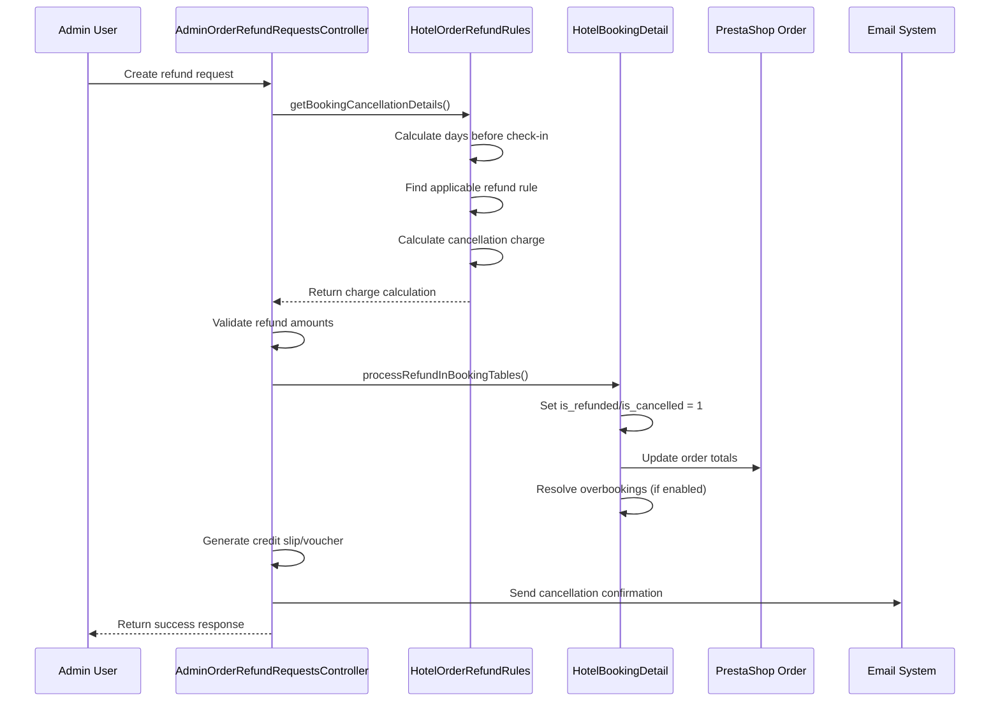

# Hotel Reservation Cancellation System Analysis

## Overview

This document provides a comprehensive analysis of the existing hotel reservation cancellation system within the `hotelreservationsystem` module, including business logic, database architecture, and current workflows. This analysis serves as the foundation for implementing customer-facing cancellation APIs.

## Table of Contents

1. [System Architecture](#system-architecture)
2. [Business Logic Analysis](#business-logic-analysis)
3. [Database Schema](#database-schema)
4. [Cancellation Workflow](#cancellation-workflow)
5. [Integration Points](#integration-points)
6. [Configuration Options](#configuration-options)
7. [Security Considerations](#security-considerations)

---

## System Architecture

### Core Components

The hotel reservation cancellation system is built around several key PHP classes that work together to provide flexible, configurable cancellation policies:

#### Primary Classes

1. **`HotelOrderRefundRules`** (`classes/HotelOrderRefundRules.php`)
   - Defines global refund/cancellation rules
   - Supports both percentage and fixed amount deductions
   - Handles multi-language rule descriptions
   - Manages time-based rule application (days before check-in)

2. **`HotelBranchRefundRules`** (`classes/HotelBranchRefundRules.php`)
   - Links global refund rules to specific hotels
   - Provides hotel-specific rule positioning/ordering
   - Enables per-hotel cancellation policy customization

3. **`HotelBookingDetail`** (`classes/HotelBookingDetail.php`)
   - Main booking entity with cancellation status tracking
   - Contains `is_cancelled` and `is_refunded` status fields
   - Implements `processRefundInBookingTables()` method
   - Handles automatic overbooking resolution

4. **`AdminOrderRefundRequestsController`** (`controllers/admin/AdminOrderRefundRequestsController.php`)
   - Processes refund requests through admin interface
   - Coordinates between booking tables and PrestaShop order system
   - Handles credit slip generation, voucher creation, and transaction records

#### Supporting Classes

- **`ServiceProductOrderDetail`** - Manages cancellation of additional services
- **`HotelBookingDemands`** - Handles extra demand cancellations
- **`OrderReturn`** / **`OrderReturnDetail`** - PrestaShop core refund tracking

### Module Integration

The cancellation system seamlessly integrates with:
- **PrestaShop Order Management** - Order status transitions, payment handling
- **Hotel Reservation Core** - Room availability, overbooking resolution
- **Email System** - Automated cancellation notifications
- **Multi-currency System** - Currency conversion for international bookings

---

## Business Logic Analysis

### Refund Rule Types

#### 1. Fixed Amount Rules (`WK_REFUND_RULE_PAYMENT_TYPE_FIXED = 1`)
- Deducts a specific monetary amount as cancellation charge
- Configured via `deduction_value_full_pay` and `deduction_value_adv_pay` fields
- Supports automatic currency conversion for international orders
- Example: $50 cancellation fee regardless of booking amount

#### 2. Percentage Rules (`WK_REFUND_RULE_PAYMENT_TYPE_PERCENTAGE = 2`)
- Deducts a percentage of the total booking amount
- Applied to: room charges + extra demands + service products
- More flexible for variable booking amounts
- Example: 25% cancellation charge

### Payment Type Differentiation

The system recognizes two payment scenarios:

1. **Full Payment Orders** (`is_advance_payment = 0`)
   - Uses `deduction_value_full_pay` field from refund rules
   - Applied when customer has paid the complete booking amount

2. **Advance Payment Orders** (`is_advance_payment = 1`)
   - Uses `deduction_value_adv_pay` field from refund rules
   - Applied when customer has made only partial/advance payment
   - May have different cancellation charges

### Time-Based Rule Application

```php
// Core logic from getBookingCancellationDetails()
$dateRequest = date('Y-m-d', strtotime($booking['date_add']));
$startDate = date_create($objHtlBooking->date_from);
$dateRequest = date_create($dateRequest);
$daysDifference = date_diff($startDate, $dateRequest);
$daysBeforeCancel = (int) $daysDifference->format('%a');

// Find applicable rule
foreach ($refundRules as $refRule) {
    if ($daysBeforeCancel >= $refRule['days']) {
        // Apply this rule
        break;
    }
}
```

**Rule Selection Logic:**
- Rules are ordered by hotel-specific positioning (`htl_branch_refund_rules.position`)
- First rule where `daysBeforeCancel >= rule.days` is applied
- If no rules match, 100% cancellation charge is applied (no refund)

### Cancellation Charge Calculation

#### For Percentage Rules:
```php
$cancellationCharge = $totalAmount * ($refundValue / 100);
$refundAmount = $totalAmount - $cancellationCharge;
```

#### For Fixed Amount Rules:
```php
// With currency conversion if needed
if ($defaultCurrency != $orderCurrency) {
    $cancellationCharge = Tools::convertPriceFull(
        $refundValue,
        $objDefaultCurrency,
        $objOrderCurrency
    );
} else {
    $cancellationCharge = $refundValue;
}
$refundAmount = $totalAmount - $cancellationCharge;
```

### Total Amount Calculation

The total booking amount includes:
```php
$totalAmount = $roomPrice + $extraDemandsPrice + $serviceProductsPrice;
```

Where:
- **Room Price**: `htl_booking_detail.total_price_tax_incl`
- **Extra Demands**: Additional room services (breakfast, late checkout, etc.)
- **Service Products**: Optional hotel services booked with the room

---

## Database Schema

### Core Tables

#### `htl_booking_detail`
```sql
-- Booking status tracking fields
`is_refunded` tinyint(1) NOT NULL DEFAULT '0'  -- Room booking refunded
`is_cancelled` tinyint(1) NOT NULL DEFAULT '0' -- Room booking cancelled
```

**Status Field Usage:**
- `is_refunded = 1`: Booking has been refunded (payment involved)
- `is_cancelled = 1`: Booking has been cancelled (free cancellation or no payment)
- Both can be `1` for complete cancellation with refund

#### `htl_order_refund_rules`
```sql
CREATE TABLE htl_order_refund_rules (
    id_refund_rule INT AUTO_INCREMENT PRIMARY KEY,
    payment_type TINYINT(3) NOT NULL,              -- 1=Fixed, 2=Percentage
    days DECIMAL(10,2) NOT NULL,                   -- Days before check-in
    deduction_value_full_pay DECIMAL(20,6) NOT NULL,  -- Rule for full payment
    deduction_value_adv_pay DECIMAL(20,6) NOT NULL,   -- Rule for advance payment
    date_add DATETIME NOT NULL,
    date_upd DATETIME NOT NULL
);
```

#### `htl_order_refund_rules_lang`
```sql
CREATE TABLE htl_order_refund_rules_lang (
    id_refund_rule INT NOT NULL,
    id_lang INT NOT NULL,
    name VARCHAR(255) NOT NULL,                    -- Rule display name
    description TEXT NOT NULL,                     -- Rule description
    PRIMARY KEY (id_refund_rule, id_lang)
);
```

#### `htl_branch_refund_rules`
```sql
CREATE TABLE htl_branch_refund_rules (
    id_hotel_refund_rule INT AUTO_INCREMENT PRIMARY KEY,
    id_refund_rule INT NOT NULL,                   -- Links to htl_order_refund_rules
    id_hotel INT NOT NULL,                         -- Specific hotel
    position INT NOT NULL DEFAULT '0',             -- Rule application order
    date_add DATETIME NOT NULL,
    date_upd DATETIME NOT NULL
);
```

#### PrestaShop Integration Tables

**`order_return`** - Refund request tracking
```sql
-- Key fields for cancellation integration
id_order_return, id_order, state (pending/approved/denied)
```

**`order_return_detail`** - Specific booking items being refunded
```sql
-- Links to hotel bookings
id_htl_booking, id_service_product_order_detail, refunded_amount
```

### Database Relationships



---

## Cancellation Workflow

### Current Admin-Initiated Process



### Key Workflow Steps

1. **Request Validation**
   - Verify booking exists and is cancellable
   - Check hotel cancellation policy (`active_refund` flag)
   - Validate customer authorization

2. **Rule Application**
   - Calculate days between request date and check-in
   - Query hotel-specific refund rules ordered by position
   - Apply first matching rule based on days criteria

3. **Charge Calculation**
   - Determine total booking amount (room + extras + services)
   - Apply rule-based cancellation charge
   - Handle currency conversion if necessary
   - Calculate final refund amount

4. **Database Updates**
   - Update `htl_booking_detail` status fields
   - Create `order_return` and `order_return_detail` records
   - Update PrestaShop order totals and status
   - Process related service product cancellations

5. **Post-Processing**
   - Generate credit slips or vouchers if requested
   - Update order status (`PS_OS_REFUND` or `PS_OS_CANCELED`)
   - Resolve overbookings (make cancelled rooms available)
   - Send email notifications

6. **Financial Processing**
   - Record refund transaction details
   - Interface with payment gateways (manual/automated)
   - Update accounting records

---

## Integration Points

### PrestaShop Core Integration

#### Order Status Management
```php
// Key order statuses for cancellation
$orderStatusesToFreeRooms = array(
    Configuration::get('PS_OS_CANCELED'),  // Cancelled
    Configuration::get('PS_OS_REFUND'),    // Refunded
    Configuration::get('PS_OS_ERROR'),     // Error
);
```

#### Order Status Transition Logic
- **Partial Refund**: Order remains in current status
- **Complete Refund**: Order transitions to `PS_OS_REFUND`
- **Complete Cancellation**: Order transitions to `PS_OS_CANCELED`

### Hotel System Integration

#### Automatic Overbooking Resolution
```php
// From HotelBookingDetail::update()
if (Configuration::get('PS_OVERBOOKING_AUTO_RESOLVE')) {
    if ($this->is_refunded == 1 && $this->is_back_order == 0) {
        $this->resolveOverBookings();
    }
}
```

When a room is cancelled/refunded, the system automatically:
- Identifies customers on waiting list for the same room type
- Allocates the freed room to next customer
- Sends confirmation emails
- Updates booking statuses

### Email Notification Integration

The system integrates with PrestaShop's email system to send:
- Cancellation confirmation emails
- Refund processing notifications
- Credit slip/voucher delivery
- Overbooking resolution confirmations

---

## Configuration Options

### Global Settings

#### Module Configuration
- **`WK_ORDER_REFUND_ALLOWED`** - Global toggle for refund functionality
- **`WK_GLOBAL_REFUND_POLICY_CMS`** - Links to detailed refund policy page
- **`PS_OVERBOOKING_AUTO_RESOLVE`** - Automatic overbooking resolution

#### Hotel-Specific Configuration
- **`HotelBranchInformation.active_refund`** - Per-hotel cancellation policy toggle
- Custom refund rule positioning per hotel
- Hotel-specific email templates and policies

### Rule Configuration

#### Creating Refund Rules
```php
// Example rule creation
$refundRule = new HotelOrderRefundRules();
$refundRule->payment_type = HotelOrderRefundRules::WK_REFUND_RULE_PAYMENT_TYPE_PERCENTAGE;
$refundRule->days = 2; // Apply if cancelled 2+ days before check-in
$refundRule->deduction_value_full_pay = 25; // 25% charge for full payment
$refundRule->deduction_value_adv_pay = 50;  // 50% charge for advance payment
$refundRule->name = "48-hour cancellation policy";
$refundRule->description = "25-50% charge for cancellations within 48 hours";
$refundRule->save();
```

#### Linking Rules to Hotels
```php
// Associate rule with hotel and set priority
$branchRule = new HotelBranchRefundRules();
$branchRule->id_refund_rule = $refundRule->id;
$branchRule->id_hotel = 1;
$branchRule->position = 1; // First rule to check
$branchRule->save();
```

---

## Security Considerations

### Current System Security

#### Admin Access Control
- Refund requests processed through authenticated admin interface
- Role-based permissions for refund operations
- Audit trail of all refund actions

#### Data Validation
- Input validation for refund amounts and reasons
- Business rule validation (cancellation deadlines, booking status)
- Multi-step confirmation for significant refunds

#### Financial Controls
- Separation between refund authorization and processing
- Credit slip generation for accounting compliance
- Transaction logging for audit purposes

### API Security Requirements

For external API implementation, additional security measures needed:

#### Customer Authentication
```php
// Required validation pattern
- Customer ID + Secure Key verification
- Booking ownership validation
- Rate limiting for cancellation requests
- HTTPS-only communication
```

#### Business Rule Enforcement
```php
// Key validations for API
- Check hotel allows cancellations (active_refund flag)
- Verify cancellation deadline not passed
- Ensure booking not already cancelled/refunded
- Validate booking status allows cancellation
```

---

## System Strengths & Capabilities

### Advanced Features

1. **Flexible Rule Engine**
   - Time-based cancellation policies
   - Hotel-specific rule customization
   - Multiple rule types (percentage/fixed)
   - Multi-currency support

2. **Comprehensive Integration**
   - Seamless PrestaShop order management
   - Automatic room reallocation
   - Email notification system
   - Accounting system integration

3. **Business Intelligence**
   - Complete audit trail
   - Refund analytics and reporting
   - Customer behavior tracking
   - Revenue protection through configurable policies

4. **Operational Efficiency**
   - Automated overbooking resolution
   - Bulk refund processing
   - Credit slip and voucher generation
   - Multi-language policy descriptions

### Extensibility Points

The current system provides excellent foundation for:
- Customer self-service cancellation APIs
- Mobile app integration
- Third-party booking platform integration
- Advanced analytics and reporting
- Automated refund processing with payment gateways

This analysis demonstrates that the hotel reservation system has a mature, production-ready cancellation infrastructure that can effectively support external API requirements while maintaining business rule integrity and operational efficiency.