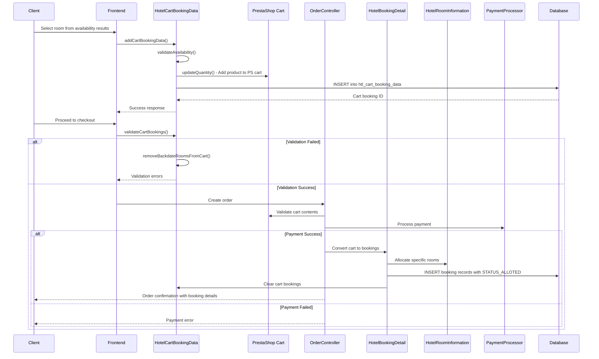
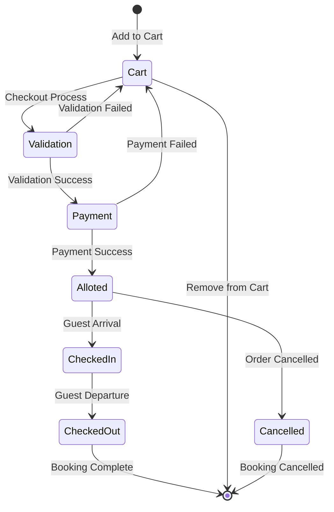

# Hotel Cart and Booking Flow

## Overview

The cart and booking flow manages the process from room selection to confirmed reservation. This document outlines how rooms are added to cart, validated, and converted to confirmed bookings through the order process.

## Flow Diagram



## Process Steps

### 1. Add Room to Cart

**File:** `/modules/hotelreservationsystem/classes/HotelCartBookingData.php:445-547`

#### Input Parameters
```php
$cartBookingData = array(
    'id_cart' => $cartId,
    'id_guest' => $guestId,
    'id_customer' => $customerId,
    'id_product' => $productId,
    'id_room' => $roomId,
    'id_hotel' => $hotelId,
    'room_num' => $roomNumber,
    'date_from' => $checkInDate,
    'date_to' => $checkOutDate,
    'adults' => $adultsCount,
    'children' => $childrenCount,
    'child_ages' => json_encode($childAges),
    'is_refunded' => 0,
    'is_back_order' => 0
);
```

#### Validation Steps
1. **Room Availability Check**
   - Verify room is not already booked for date range
   - Check room status is active
   - Validate against disable dates

2. **Occupancy Validation**
   - Verify occupancy doesn't exceed room capacity
   - Validate adult and children limits
   - Check maximum guest restrictions

3. **Business Rules Check**
   - Length of stay requirements
   - Advance booking restrictions
   - Hotel-specific booking rules

4. **PrestaShop Cart Integration**
   ```php
   // Add product to PrestaShop cart
   $cart->updateQty(1, $productId, null, false, 'up', 0, null, true);
   ```

### 2. Cart Validation Process

**File:** `/modules/hotelreservationsystem/classes/HotelCartBookingData.php:924-1076`

#### Real-time Validation
The system continuously validates cart contents:

```php
public function validateCartBookings($idCart, $idGuest = null, $idCustomer = null)
{
    $validationErrors = array();
    $cartBookings = $this->getCartBookingDetailsByIdCartIdGuest($idCart, $idGuest, $idCustomer);
    
    foreach ($cartBookings as $booking) {
        // Check room availability
        if (!$this->isRoomAvailable($booking)) {
            $validationErrors[] = "Room {$booking['room_num']} is no longer available";
        }
        
        // Check date validity
        if ($this->isBookingInPast($booking)) {
            $validationErrors[] = "Booking dates cannot be in the past";
        }
        
        // Check occupancy limits
        if (!$this->validateOccupancy($booking)) {
            $validationErrors[] = "Occupancy exceeds room capacity";
        }
    }
    
    return $validationErrors;
}
```

#### Automatic Cart Cleanup
**File:** `/modules/hotelreservationsystem/classes/HotelCartBookingData.php:779-859`

```php
public function removeBackdateRoomsFromCart($idCart)
{
    $currentDate = date('Y-m-d');
    $backDateBookings = Db::getInstance()->executeS('
        SELECT * FROM `'._DB_PREFIX_.'htl_cart_booking_data` 
        WHERE `id_cart` = '.(int)$idCart.' 
        AND `date_from` < "'.$currentDate.'"
    ');
    
    foreach ($backDateBookings as $booking) {
        $this->deleteCartBookingData($booking['id'], $idCart);
    }
}
```

### 3. Cart to Order Conversion

**File:** `/modules/hotelreservationsystem/classes/HotelBookingDetail.php:1500-1800`

#### Order Creation Process
1. **PrestaShop Order Creation**
   - Standard e-commerce order process
   - Cart validation and payment processing
   - Order state management

2. **Hotel Booking Creation**
   ```php
   public function createBookingFromCart($idOrder, $idCart)
   {
       $cartBookings = $this->getCartBookingData($idCart);
       
       foreach ($cartBookings as $cartBooking) {
           // Create hotel booking record
           $hotelBooking = new HotelBookingDetail();
           $hotelBooking->id_order = $idOrder;
           $hotelBooking->id_product = $cartBooking['id_product'];
           $hotelBooking->id_room = $cartBooking['id_room'];
           $hotelBooking->id_hotel = $cartBooking['id_hotel'];
           $hotelBooking->room_num = $cartBooking['room_num'];
           $hotelBooking->date_from = $cartBooking['date_from'];
           $hotelBooking->date_to = $cartBooking['date_to'];
           $hotelBooking->adults = $cartBooking['adults'];
           $hotelBooking->children = $cartBooking['children'];
           $hotelBooking->child_ages = $cartBooking['child_ages'];
           $hotelBooking->booking_type = self::STATUS_ALLOTED;
           $hotelBooking->is_refunded = 0;
           $hotelBooking->date_add = date('Y-m-d H:i:s');
           
           if (!$hotelBooking->save()) {
               throw new Exception('Failed to create hotel booking');
           }
       }
       
       // Clear cart bookings after successful conversion
       $this->clearCartBookings($idCart);
   }
   ```

### 4. Room Allocation Process

**File:** `/modules/hotelreservationsystem/classes/HotelRoomInformation.php:300-400`

#### Automatic Room Assignment
```php
public function allocateRoomForBooking($idRoomType, $checkIn, $checkOut, $occupancy)
{
    // Find available room of specified type
    $availableRooms = $this->getAvailableRooms($idRoomType, $checkIn, $checkOut);
    
    // Apply occupancy filters
    $suitableRooms = $this->filterByOccupancy($availableRooms, $occupancy);
    
    // Select best room (e.g., lowest room number, best condition)
    $selectedRoom = $this->selectOptimalRoom($suitableRooms);
    
    return $selectedRoom;
}
```

#### Manual Room Assignment
For premium bookings or special requirements:
```php
public function assignSpecificRoom($idRoom, $checkIn, $checkOut)
{
    // Verify room availability
    if (!$this->isRoomAvailable($idRoom, $checkIn, $checkOut)) {
        throw new Exception('Selected room is not available');
    }
    
    // Reserve the specific room
    return $this->reserveRoom($idRoom, $checkIn, $checkOut);
}
```

## Key Database Operations

### Cart Booking Storage
**Table:** `htl_cart_booking_data`

```sql
CREATE TABLE htl_cart_booking_data (
    id int(11) NOT NULL AUTO_INCREMENT,
    id_cart int(11) NOT NULL,
    id_guest int(11) DEFAULT NULL,
    id_customer int(11) DEFAULT NULL,
    id_product int(11) NOT NULL,
    id_room int(11) NOT NULL,
    id_hotel int(11) NOT NULL,
    room_num varchar(225) NOT NULL,
    date_from datetime NOT NULL,
    date_to datetime NOT NULL,
    adults smallint(6) NOT NULL DEFAULT '0',
    children smallint(6) NOT NULL DEFAULT '0',
    child_ages text,
    is_refunded tinyint(4) NOT NULL DEFAULT '0',
    is_back_order tinyint(4) NOT NULL DEFAULT '0',
    extra_demands text,
    date_add datetime NOT NULL,
    date_upd datetime NOT NULL,
    PRIMARY KEY (id),
    KEY id_cart (id_cart),
    KEY date_from (date_from),
    KEY date_to (date_to)
);
```

### Booking Records Storage
**Table:** `htl_booking_detail`

```sql
CREATE TABLE htl_booking_detail (
    id int(11) NOT NULL AUTO_INCREMENT,
    id_product int(11) NOT NULL,
    id_order int(11) NOT NULL,
    id_cart int(11) NOT NULL,
    id_room int(11) NOT NULL,
    id_hotel int(11) NOT NULL,
    id_customer int(11) NOT NULL,
    booking_type tinyint(4) NOT NULL,
    comment text,
    check_in datetime DEFAULT NULL,
    check_out datetime DEFAULT NULL,
    date_from datetime NOT NULL,
    date_to datetime NOT NULL,
    total_price_tax_excl decimal(20,6) NOT NULL DEFAULT '0.000000',
    total_price_tax_incl decimal(20,6) NOT NULL DEFAULT '0.000000',
    room_num varchar(225) NOT NULL,
    adults smallint(6) NOT NULL DEFAULT '0',
    children smallint(6) NOT NULL DEFAULT '0',
    child_ages text,
    is_refunded tinyint(4) NOT NULL DEFAULT '0',
    is_cancelled tinyint(4) NOT NULL DEFAULT '0',
    date_add datetime NOT NULL,
    date_upd datetime NOT NULL,
    PRIMARY KEY (id),
    KEY id_order (id_order),
    KEY id_room (id_room),
    KEY date_from (date_from),
    KEY date_to (date_to)
);
```

## Booking Status Lifecycle

### Status Constants
**File:** `/modules/hotelreservationsystem/classes/HotelBookingDetail.php:73-77`

```php
const STATUS_ALLOTED = 1;        // Room assigned to booking
const STATUS_CHECKED_IN = 2;     // Guest has checked in
const STATUS_CHECKED_OUT = 3;    // Guest has checked out
```

### Status Transitions


## Error Handling and Recovery

### Common Error Scenarios

#### 1. Room Availability Conflicts
```php
// Handle race conditions in room booking
try {
    $this->addCartBookingData($bookingData);
} catch (RoomNotAvailableException $e) {
    // Offer alternative rooms
    $alternatives = $this->findAlternativeRooms($bookingData);
    return array('error' => 'Room not available', 'alternatives' => $alternatives);
}
```

#### 2. Cart Validation Failures
```php
// Handle cart validation issues
$validationErrors = $this->validateCartBookings($idCart);
if (!empty($validationErrors)) {
    // Clean up invalid bookings
    $this->removeInvalidBookings($idCart, $validationErrors);
    // Notify user of changes
    return array('warnings' => $validationErrors);
}
```

#### 3. Payment Processing Failures
```php
// Handle payment failures gracefully
try {
    $paymentResult = $this->processPayment($orderData);
    if ($paymentResult['success']) {
        $this->createBookingFromCart($idOrder, $idCart);
    }
} catch (PaymentException $e) {
    // Keep cart intact, allow retry
    $this->logPaymentFailure($e);
    return array('error' => 'Payment failed', 'retry' => true);
}
```

## Integration Points

### PrestaShop E-commerce Integration
- **Cart System:** Leverages PS cart for product management
- **Order System:** Uses PS order lifecycle
- **Customer System:** Integrates with PS customer accounts
- **Payment System:** Uses PS payment modules

### Hotel-Specific Extensions
- **Room Management:** Hotel-specific room allocation
- **Occupancy Tracking:** Guest count and age management  
- **Date Management:** Check-in/out date handling
- **Service Products:** Additional hotel services

## Performance Optimizations

### Database Optimizations
- Indexed searches on booking dates
- Optimized cart validation queries
- Batch operations for bulk bookings

### Caching Strategies
- Room availability caching
- Cart state caching
- Validation result caching

### Concurrent Booking Handling
- Row-level locking for room allocation
- Optimistic concurrency control
- Graceful degradation under load

This cart and booking flow ensures a smooth transition from room selection to confirmed reservation while maintaining data integrity and providing excellent user experience.