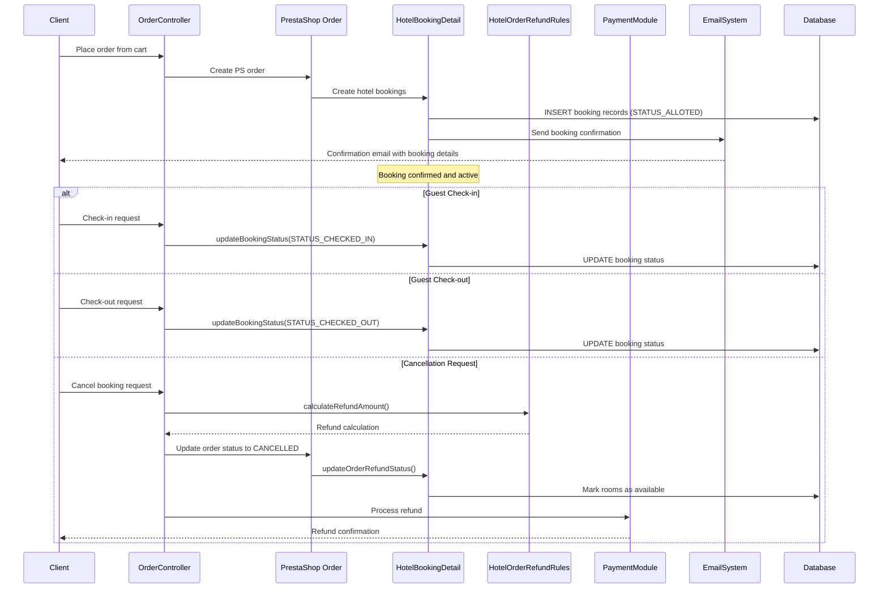
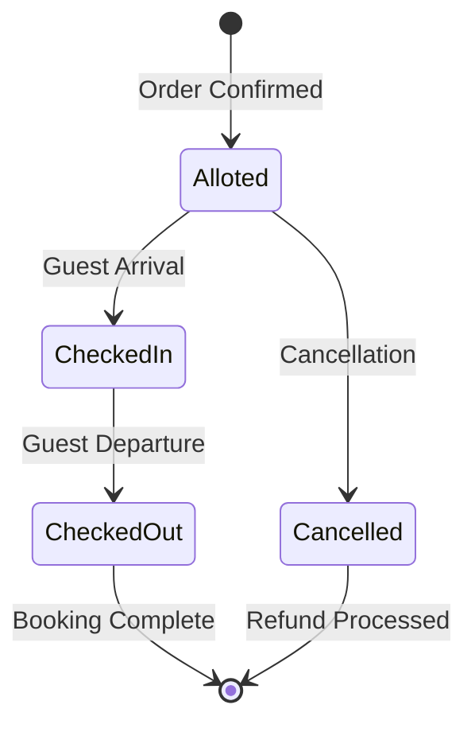

# Hotel Order Management Flow

## Overview

The order management flow handles the complete lifecycle of hotel bookings from order creation through check-out, including refunds, cancellations, and status updates. This document outlines how hotel orders integrate with PrestaShop's order system while maintaining hotel-specific business logic.

## Flow Diagram



## Order Creation Process

### 1. PrestaShop Order Integration

**File:** `/modules/hotelreservationsystem/hotelreservationsystem.php:111-284`

The system extends PrestaShop's order functionality to handle hotel-specific data:

```php
public function cartBookingDataForMail($order)
{
    $result = array();
    $customer = new Customer($order->id_customer);
    $products = $order->getProducts();
    
    if (Module::isInstalled('hotelreservationsystem')) {
        $objCartBkData = new HotelCartBookingData();
        $objHtlBkDtl = new HotelBookingDetail();
        $objRmType = new HotelRoomType();
        $objBookingDemand = new HotelBookingDemands();
        
        $cart_htl_data = array();
        
        foreach ($products as $type_key => $type_value) {
            // Process each room type in the order
            $product = new Product($type_value['product_id'], false, $this->context->language->id);
            $cart_bk_data = $objCartBkData->getOnlyCartBookingData(
                $order->id_cart, 
                $customer->id_guest, 
                $type_value['product_id'], 
                $customer->id
            );
            
            if ($cart_bk_data) {
                $rm_dtl = $objRmType->getRoomTypeInfoByIdProduct($type_value['product_id']);
                
                // Build hotel data structure for email/display
                $cart_htl_data[$type_key] = array(
                    'id_product' => $type_value['product_id'],
                    'name' => $product->name,
                    'hotel_name' => $rm_dtl['hotel_name'],
                    'adults' => $rm_dtl['adults'],
                    'children' => $rm_dtl['children'],
                    'date_ranges' => array()
                );
                
                foreach ($cart_bk_data as $data_k => $data_v) {
                    // Process each booking date range
                    $date_join = strtotime($data_v['date_from']).strtotime($data_v['date_to']);
                    $num_days = HotelHelper::getNumberOfDays($data_v['date_from'], $data_v['date_to']);
                    
                    // Calculate room pricing
                    $roomTypeDateRangePrice = HotelRoomTypeFeaturePricing::getRoomTypeTotalPrice(
                        $type_value['id_product'], 
                        $data_v['date_from'], 
                        $data_v['date_to']
                    );
                    
                    $cart_htl_data[$type_key]['date_ranges'][$date_join] = array(
                        'date_from' => $data_v['date_from'],
                        'date_to' => $data_v['date_to'],
                        'num_days' => $num_days,
                        'amount' => $roomTypeDateRangePrice['total_price_tax_incl'],
                        'room_num' => $data_v['room_num']
                    );
                }
            }
        }
        
        $result['cart_htl_data'] = $cart_htl_data;
    }
    
    return $result;
}
```

### 2. Hotel Booking Creation

**File:** `/modules/hotelreservationsystem/classes/HotelBookingDetail.php:1500-1800`

When a PrestaShop order is created, hotel bookings are automatically generated:

```php
public function createHotelBookingsFromOrder($idOrder)
{
    $order = new Order($idOrder);
    $cartBookings = $this->getCartBookingsByIdCart($order->id_cart);
    
    foreach ($cartBookings as $cartBooking) {
        $hotelBooking = new HotelBookingDetail();
        
        // Basic booking information
        $hotelBooking->id_order = $idOrder;
        $hotelBooking->id_cart = $order->id_cart;
        $hotelBooking->id_customer = $order->id_customer;
        $hotelBooking->id_product = $cartBooking['id_product'];
        $hotelBooking->id_room = $cartBooking['id_room'];
        $hotelBooking->id_hotel = $cartBooking['id_hotel'];
        $hotelBooking->room_num = $cartBooking['room_num'];
        
        // Date and occupancy information
        $hotelBooking->date_from = $cartBooking['date_from'];
        $hotelBooking->date_to = $cartBooking['date_to'];
        $hotelBooking->adults = $cartBooking['adults'];
        $hotelBooking->children = $cartBooking['children'];
        $hotelBooking->child_ages = $cartBooking['child_ages'];
        
        // Pricing information
        $priceData = $this->calculateBookingPrice($cartBooking);
        $hotelBooking->total_price_tax_excl = $priceData['tax_excl'];
        $hotelBooking->total_price_tax_incl = $priceData['tax_incl'];
        
        // Status and metadata
        $hotelBooking->booking_type = self::STATUS_ALLOTED;
        $hotelBooking->is_refunded = 0;
        $hotelBooking->is_cancelled = 0;
        $hotelBooking->date_add = date('Y-m-d H:i:s');
        
        if (!$hotelBooking->save()) {
            throw new Exception('Failed to create hotel booking for order: ' . $idOrder);
        }
        
        // Handle extra demands and service products
        $this->createBookingExtraDemands($hotelBooking->id, $cartBooking);
        $this->createBookingServiceProducts($hotelBooking->id, $cartBooking);
    }
    
    // Clear cart bookings after successful conversion
    $this->clearCartBookings($order->id_cart);
}
```

## Order Status Management

### 1. Status Hook Integration

**File:** `/modules/hotelreservationsystem/hotelreservationsystem.php:478-493`

The system hooks into PrestaShop's order status changes:

```php
public function hookActionOrderStatusPostUpdate($params)
{
    $objHtlBkDtl = new HotelBookingDetail();
    
    // Make rooms available for booking if order status is cancelled, refunded or error
    if (in_array($params['newOrderStatus']->id, $objHtlBkDtl->getOrderStatusToFreeBookedRoom())) {
        // Determine if booking is being cancelled
        $isCancelled = null;
        if ($params['newOrderStatus']->id == Configuration::get('PS_OS_CANCELED')) {
            $isCancelled = 1;
        }
        
        // Update booking status and free rooms
        if (!$objHtlBkDtl->updateOrderRefundStatus(
            $params['id_order'], 
            false, 
            false, 
            array(), 
            1, 
            $isCancelled
        )) {
            $this->context->controller->errors[] = $this->l(
                'Error while making booked rooms available, attached with this order. Please try again !!'
            );
        }
    }
}
```

### 2. Booking Status Updates

**File:** `/modules/hotelreservationsystem/classes/HotelBookingDetail.php:2000-2200`

#### Check-in Process
```php
public function checkInBooking($idBooking, $checkInTime = null)
{
    $booking = new HotelBookingDetail($idBooking);
    
    if ($booking->booking_type != self::STATUS_ALLOTED) {
        throw new Exception('Booking is not in alloted status');
    }
    
    // Validate check-in date
    $currentDate = date('Y-m-d');
    $bookingDate = date('Y-m-d', strtotime($booking->date_from));
    
    if ($currentDate < $bookingDate) {
        throw new Exception('Cannot check-in before booking date');
    }
    
    // Update booking status
    $booking->booking_type = self::STATUS_CHECKED_IN;
    $booking->check_in = $checkInTime ?: date('Y-m-d H:i:s');
    $booking->date_upd = date('Y-m-d H:i:s');
    
    if (!$booking->save()) {
        throw new Exception('Failed to update check-in status');
    }
    
    // Log check-in activity
    $this->logBookingActivity($idBooking, 'CHECK_IN', $booking->check_in);
    
    return true;
}
```

#### Check-out Process
```php
public function checkOutBooking($idBooking, $checkOutTime = null)
{
    $booking = new HotelBookingDetail($idBooking);
    
    if ($booking->booking_type != self::STATUS_CHECKED_IN) {
        throw new Exception('Guest must be checked-in to check-out');
    }
    
    // Update booking status
    $booking->booking_type = self::STATUS_CHECKED_OUT;
    $booking->check_out = $checkOutTime ?: date('Y-m-d H:i:s');
    $booking->date_upd = date('Y-m-d H:i:s');
    
    if (!$booking->save()) {
        throw new Exception('Failed to update check-out status');
    }
    
    // Make room available for new bookings
    $this->makeRoomAvailable($booking->id_room, $booking->date_to);
    
    // Log check-out activity
    $this->logBookingActivity($idBooking, 'CHECK_OUT', $booking->check_out);
    
    return true;
}
```

## Refund and Cancellation Management

### 1. Refund Rules Engine

**File:** `/modules/hotelreservationsystem/classes/HotelOrderRefundRules.php:1-300`

#### Refund Rule Structure
```php
class HotelOrderRefundRules extends ObjectModel
{
    public $id;
    public $name;
    public $description;
    public $days_before_checkin;
    public $refund_percentage;
    public $is_active;
    public $position;
    public $date_add;
    public $date_upd;
    
    protected static $definition = array(
        'table' => 'htl_order_refund_rules',
        'primary' => 'id',
        'multilang' => true,
        'fields' => array(
            'days_before_checkin' => array('type' => self::TYPE_INT, 'validate' => 'isUnsignedInt', 'required' => true),
            'refund_percentage' => array('type' => self::TYPE_FLOAT, 'validate' => 'isFloat', 'required' => true),
            'is_active' => array('type' => self::TYPE_BOOL, 'validate' => 'isBool'),
            'position' => array('type' => self::TYPE_INT, 'validate' => 'isUnsignedInt'),
            'date_add' => array('type' => self::TYPE_DATE, 'validate' => 'isDate'),
            'date_upd' => array('type' => self::TYPE_DATE, 'validate' => 'isDate'),
            
            // Lang fields
            'name' => array('type' => self::TYPE_STRING, 'lang' => true, 'validate' => 'isGenericName', 'required' => true, 'size' => 128),
            'description' => array('type' => self::TYPE_HTML, 'lang' => true, 'validate' => 'isCleanHtml'),
        ),
    );
}
```

#### Refund Calculation
```php
public function calculateRefundAmount($idOrder, $cancellationDate = null)
{
    $cancellationDate = $cancellationDate ?: date('Y-m-d');
    $bookings = $this->getOrderBookings($idOrder);
    $totalRefund = 0;
    
    foreach ($bookings as $booking) {
        $checkInDate = date('Y-m-d', strtotime($booking['date_from']));
        $daysBeforeCheckIn = (strtotime($checkInDate) - strtotime($cancellationDate)) / (24 * 60 * 60);
        
        // Find applicable refund rule
        $refundRule = $this->getApplicableRefundRule($daysBeforeCheckIn);
        
        if ($refundRule) {
            $refundPercentage = $refundRule['refund_percentage'];
            $bookingAmount = $booking['total_price_tax_incl'];
            $refundAmount = ($bookingAmount * $refundPercentage) / 100;
            
            $totalRefund += $refundAmount;
        }
    }
    
    return array(
        'total_paid' => $this->getOrderTotalPaid($idOrder),
        'refund_amount' => $totalRefund,
        'refund_percentage' => ($totalRefund / $this->getOrderTotalPaid($idOrder)) * 100,
        'applicable_rules' => $this->getAppliedRules($idOrder, $cancellationDate)
    );
}
```

### 2. Cancellation Process

**File:** `/modules/hotelreservationsystem/classes/HotelBookingDetail.php:2500-2800`

```php
public function cancelOrderBookings($idOrder, $refundAmount = null, $refundReason = null)
{
    $bookings = $this->getBookingsByIdOrder($idOrder);
    
    foreach ($bookings as $booking) {
        // Update booking status
        $bookingObj = new HotelBookingDetail($booking['id']);
        $bookingObj->is_cancelled = 1;
        $bookingObj->date_upd = date('Y-m-d H:i:s');
        
        if (!$bookingObj->save()) {
            throw new Exception('Failed to cancel booking: ' . $booking['id']);
        }
        
        // Make room available
        $this->makeRoomAvailable($booking['id_room'], $booking['date_from']);
        
        // Log cancellation
        $this->logBookingActivity($booking['id'], 'CANCELLED', null, $refundReason);
    }
    
    // Update order status
    $order = new Order($idOrder);
    $order->setCurrentState(Configuration::get('PS_OS_CANCELED'));
    
    // Process refund if amount specified
    if ($refundAmount > 0) {
        $this->processRefund($idOrder, $refundAmount, $refundReason);
    }
    
    return true;
}
```

## Email Notifications

### 1. Booking Confirmation Emails

**File:** `/modules/hotelreservationsystem/mails/templates/booking_confirmation.html`

The system sends detailed booking confirmations with:
- Hotel and room details
- Check-in/check-out dates and times
- Guest occupancy information
- Total pricing breakdown
- Additional services and demands
- Booking reference number
- Hotel contact information

### 2. Status Change Notifications

#### Check-in Confirmation
```php
public function sendCheckInNotification($idBooking)
{
    $booking = $this->getBookingDetails($idBooking);
    $customer = new Customer($booking['id_customer']);
    
    $templateVars = array(
        'booking' => $booking,
        'customer' => $customer,
        'hotel' => $this->getHotelDetails($booking['id_hotel']),
        'check_in_time' => $booking['check_in']
    );
    
    Mail::Send(
        $this->context->language->id,
        'check_in_confirmation',
        Mail::l('Check-in Confirmation'),
        $templateVars,
        $customer->email,
        $customer->firstname . ' ' . $customer->lastname,
        null,
        null,
        null,
        null,
        _PS_MODULE_DIR_ . 'hotelreservationsystem/mails/'
    );
}
```

#### Cancellation Notification
```php
public function sendCancellationNotification($idOrder, $refundDetails)
{
    $order = new Order($idOrder);
    $customer = new Customer($order->id_customer);
    $bookings = $this->getOrderBookings($idOrder);
    
    $templateVars = array(
        'order' => $order,
        'customer' => $customer,
        'bookings' => $bookings,
        'refund_amount' => $refundDetails['refund_amount'],
        'refund_percentage' => $refundDetails['refund_percentage']
    );
    
    Mail::Send(
        $this->context->language->id,
        'booking_cancellation',
        Mail::l('Booking Cancellation Confirmation'),
        $templateVars,
        $customer->email,
        $customer->firstname . ' ' . $customer->lastname
    );
}
```

## Order Data Structure

### Core Order Tables Integration

#### PrestaShop Orders
```sql
-- Standard PrestaShop order table
orders (
    id_order,
    id_customer,
    id_cart,
    current_state,
    payment,
    total_paid,
    total_paid_tax_incl,
    total_paid_tax_excl,
    date_add,
    date_upd
)
```

#### Hotel Bookings Extension
```sql
-- Hotel-specific booking details
htl_booking_detail (
    id,
    id_order,           -- Links to PrestaShop order
    id_cart,
    id_customer,
    id_product,         -- Room type product
    id_room,            -- Specific room assigned
    id_hotel,           -- Hotel property
    booking_type,       -- Status (alloted/checked_in/checked_out)
    date_from,          -- Check-in date
    date_to,            -- Check-out date
    check_in,           -- Actual check-in timestamp
    check_out,          -- Actual check-out timestamp
    adults,
    children,
    child_ages,
    total_price_tax_incl,
    total_price_tax_excl,
    room_num,
    is_refunded,
    is_cancelled,
    date_add,
    date_upd
)
```

#### Extra Demands and Services
```sql
-- Additional demands (like extra bed, late check-in)
htl_booking_demands (
    id,
    id_htl_booking,     -- Links to htl_booking_detail
    id_global_demand,
    name,
    unit_price_tax_excl,
    unit_price_tax_incl,
    total_price_tax_excl,
    total_price_tax_incl,
    date_add,
    date_upd
)

-- Additional services (like spa, restaurant)
service_product_order_detail (
    id,
    id_order,
    id_order_detail,
    id_product,         -- Service product
    id_htl_booking,     -- Links to htl_booking_detail
    unit_price_tax_excl,
    unit_price_tax_incl,
    total_price_tax_excl,
    total_price_tax_incl,
    quantity,
    date_add,
    date_upd
)
```

## Business Rules and Validations

### 1. Booking Modification Rules
- **Pre Check-in:** Full modification allowed with potential fees
- **Post Check-in:** Limited modifications (extend stay, add services)
- **Post Check-out:** No modifications allowed

### 2. Cancellation Policies
- **Free Cancellation Period:** Typically 24-48 hours before check-in
- **Partial Refund Period:** Based on refund rules configuration
- **No Refund Period:** Within 24 hours of check-in

### 3. Status Transition Rules


## Performance Considerations

### 1. Database Optimization
- Indexed searches on order and booking dates
- Optimized joins between order and hotel tables
- Efficient status queries with proper indexing

### 2. Email Queue Management
- Background processing for email notifications
- Template caching for faster email generation
- Batch processing for bulk notifications

### 3. Refund Processing
- Asynchronous refund processing
- Audit trails for refund transactions
- Integration with payment gateway refund APIs

This order management flow ensures comprehensive handling of hotel bookings while maintaining full integration with PrestaShop's robust e-commerce platform.